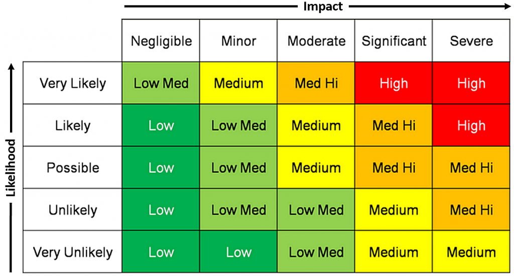

# Risk Assessment of Sparrow

## Overall Risk Scores

Total Risk: High
Likelihood: Likely
Impact: Severe
Base CVSS Score: 9.8

### Risk Matrix

## Risk Explanation
Likelihood: The likelihood of this vulnerability being exploited is high. The vulnerability is not complicated, and does not require a large amount of pre-requisite knowledge to exploit. Additionally, since this vulnerability exists on a public website, it is exceptionally likely to be scanned.

Impact: The impact of this vulnerability being exploited is severe. The vulnerability leads to abitrary remote code execution on the underlying host. This can be used to gain remote access to the shell, and more access after that.

## CVSS Explanation
CVSS String: AV:N/AC:L/PR:N/UI:N/S:U/C:H/I:H/A:H/E:H/RL:O/RC:C

##### Attack Vector: Network
The attack can be carried out across the network from a remote host.

##### Attack Complexity: Low 
The attack requires basic http header knowledge

##### Privileges Required: None
The attack does not require any privileges on the remote host

##### User Interaction: None
The attack does not require a user to do anything

##### Scope: Unchanged
This vulnerability affects the system running on it

##### Confidentiality: High
This attack would compromise the confidentiality of all resources on the system

##### Integrity: High
This attack would compromise the integrity of all resources on the system

##### Availability: High
This attack would compromise the availability of all resources on the system

### CWE Ratings
CWE-78 Improper Neutralization of Special Elements used in an OS Command ('OS Command Injection')

CWE-235 
CWE-94

### ASVS
V5.1.1 
V5.2.5